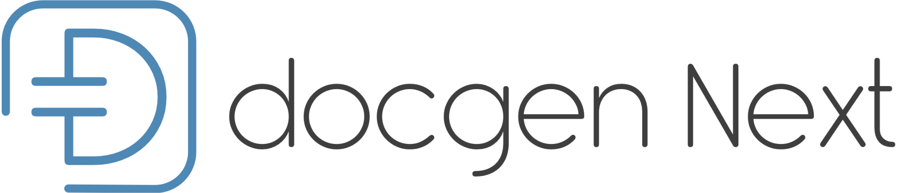

# DocGen Next

DocGen vous proposes un cadre d'écriture documentaire, tous vos projets seront organisés de la même façon, les outils nécessaires à l'écriture et dessins de diagramme sont installés et configurés. Vous n'avez plus qu'à vous lancer dans l'écriture sans vous souciez du reste.

Cet outil vous permet de créer des documentations au format HTML et PDF, il repose principalement sur [Asciidoctor.js](https://asciidoctor.org/docs/asciidoctor.js/).

## Pré-requis

:bangbang: : deux outils sont nécessaires pour utiliser DocGen Next :

1. [Node](https://nodejs.org) (v12.16.3 minimum)
2. [git](https://git-scm.com)

Optionnel : vous pouvez installer [Pandoc](https://pandoc.org) pour convertir des fichiers sur d'autres formats.

## Installer DocGen Next

Lancer la commande suivante dans un Terminal :

```bash
npm i -g docgennext
```

## Initialisation d'un projet documentaire

Une fois les étapes précédentes réalisées, lancer la commande suivante :

```bash
docgen
```

Une série de questions vous seront posées, elles permettent de configurer le projet en fonction de vos réponses.

### Arguments

Il est possible de passer outre les questions, notamment quand vous voulez automatiser un flux de production documentaire.

Pour cela rien de plus simple, renseigner chaque question par son identifiant, par exemple :

```bash
docgen --author 'Laurent Dupont' --email laurent.dupont@hotmail.com
```

Voici la liste des identifiants disponibles (liste complète) :

| Identifiant       | Exemple                                       | Type           | Requis lors des questions |
| :---------------- | :-------------------------------------------- | :------------- | :-----------------------: |
| `title`           | `--title 'ma documentation'`                  | `string`       | :heavy_check_mark:        |
| `lang`            | `--lang 1`                                    | `number`       | :heavy_check_mark:        |
| `subtitle`        | `--subtitle 'Un sous titre pour les PDF.`     | `string`       |                           |
| `author`          | `--author 'Laurent Dupont'`                   | `string`       | :heavy_check_mark:        |
| `email`           | `--email laurent.dupont@hotmail.com`          | `string`       |                           |
| `description`     | `--description 'La description de ma doc.'`   | `string`       | :heavy_check_mark:        |
| `versionDoc`      | `--versionDoc '3.2.1'`                        | `string`       |                           |
| `port`            | `--port 4545`                                 | `number`       |                           |
| `kroki`           | `--kroki http://197.129.7.12:3591`            | `string`       |                           |
| `confirm`         | `--no-autolaunch`                             | `boolean`      |                           |

Les valeurs suivantes sont par défaut initialisées à :

| Identifiant       | Valeur par défaut   | Signification                            |
| :---------------- | :-------------------| :--------------------------------------- |
| `lang`            | `0`                 | Par défaut la valeur est `0` pour `fr`.  |
| `version`         | `'0.1.0'`           | Version de votre documentation.          |
| `port`            | `8080`              | Port du serveur `localhost`.             |
| `kroki`           | `https://kroki.io/` | Serveur Kroki.                           |
| `confirm`         | `true`              | Lance le serveur automatiquement.        |

Le choix de la langue est réalisé par un `number`. La valeur `0` équivaut à `fr`, dans le cas contraire à `en`.

La version suit la [Gestion sémantique de version 2.0.0](https://semver.org/lang/fr/).

:bangbang: : afin d'indiquer un numéro de version, utiliser bien une chaîne de caractères, c'est à dire avec des guillemets pour éviter tout problème d'interprétation.

Le paramètre `title` est utilisé à la fois pour la clé `name` du fichier `package.json` et pour le titre de la documentation.

Pour les DevOps, utilisez le flag `--no-autolaunch` si vous ne souhaitez pas générer la documentation dans un navigateur après avoir alimenté toutes les questions. Si il est nécessaire d'ouvrir votre navigateur, utilisez le flag `--autolaunch`.

### Les auteurs

Dans le cas où plusieurs personnes participent à l'écriture du document, une liste de personnes peut être indiquée. Dans ce cas veuillez utiliser cette forme :

```bash
docgen --author "Alex Mitch, Paul Richard, François Rich"
```

:bangbang: : liste de prénoms, séparé par des virgules.

### Port du serveur

Une fois le projet créé, il est possible d'exécuter une commande pour afficher les résultats de votre documentation dans une page Web. Votre navigateur par défaut est lancé et se rafraichit automatiquement pour vous montrer les derniers éléments modifiés.

Il peut être important de changer cette valeur quand vous travaillez sur plusieurs documents en parallèle.

:exclamation: : prévilégiez les valeurs comprises entre `1001` & `9999`.

### Kroki

Le serveur [Kroki](https://kroki.io) permet de générer tout un ensemble de diagrammes écrit au format texte. Par défaut c'est le serveur disponible sur Internet qui est utilisé. Vous pouvez changer cette valeur pour utiliser le votre.

## Organisation d'un projet documentaire

Une fois répondu aux questions, vous allez avoir l'organisation suivante :

Concentrez votre attention sur le dossier `project/`. Il est proposé de créer un ensemble de sous-dossiers, chacun représentant une section de votre documentation. Dans chacun de ces dossiers vous y placerez les paragraphes constituant chacune des parties. Le fichier `main.adoc` doit intégrer uniquement les *imports* des fichiers de votre documentation.

### Structure des fichiers

Le projet se décompose ainsi :

- `.editorconfig` : installez un plugin [editorconfig](https://editorconfig.org) dans votre IDE si besoin,
- `.git/` et le fichier `.gitignore` pour la gestion des sources,
- `node_modules` : contenant tous les paquets node,
- `package.json` et `package-lock.json` : que nous verrons plus tard,
- `project/` dont on vient de parler,

### Personnalisation de votre documentation

[Asciidoctor.js](https://asciidoctor.org/docs/asciidoctor.js/) met à disposition un ensemble d'éléments pour que vous modifiez votre documentation comme vous le souhaitez. Fichiers CSS, *templating*, *hooks*, etc. Référez-vous à la documentation officielle du projet.

Vous pouvez facilement ajouter des fichiers, sans modification de la configuration :

- `project/docinfo/` : pour les fichiers `docinfo.html` et `docinfo-footer.html`.
- `project/icons/` : emplacement de vos icones.
- `project/images/` : pour toutes vos images *raw* (png, jpg, gif).
- `project/styles/` : mettez ici tous vos fichiers CSS.
- `project/templates/` pour y sauvegarder vos fichiers *templates* (le langage de *template* par défaut est [Nunjucks](https://mozilla.github.io/nunjucks/) mais rien ne vous empêche d'en installer d'autres).

Deux fichiers importants :

- `project/confadoc.adoc` : pour configurer votre projet avec les variables Asciidoctor.
- `project/variables.adoc` : renseignez les variables de votre documentations (références externes par exemple).

### Font Awesome

Si vous souhaitez utiliser des icônes, reportez-vous à la documentation de Asciidoctor. Les Font Awesome 5 arriveront plus tard, dans tous les cas, aujourd'hui DocGen Next ne porte pas ce sujet.

Concernant le PDF, les Font Awesome 5 sont déjà présentes.

### Styles

Afin de personnaliser vos documents, il est nécessaire de créer un ou plusieurs fichiers dans le dossier `styles`.

Dans le fichier `project/confadoc.adoc`, ajoutez la ligne suivante : `:stylesheet: ./styles/styles.css`.

Lors de l'affichage dans le navigateur web, si vous avez des erreurs concernant le *Cross origin*, désactivez-les.

### IDE

N'importe quel éditeur de texte fera l'affaire, les deux éditeurs les plus adaptés sont :

- [Sublime Text](http://www.sublimetext.com)
- [Visual Studio Code](https://code.visualstudio.com)
- Ou son *fork* qui ne récupère pas les données statistiques [VSCodium](https://github.com/VSCodium/vscodium#install-with-brew)

## Contribuer

Toute personne souhaitant participer au projet, pour l'améliorer ou proposer des évolutions est bienvenue.

## Licence

Permission to use, copy, modify, and/or distribute this software for any purpose with or without fee is hereby granted, provided that the above copyright notice and this permission notice appear in all copies.

THE SOFTWARE IS PROVIDED "AS IS" AND THE AUTHOR DISCLAIMS ALL WARRANTIES WITH REGARD TO THIS SOFTWARE INCLUDING ALL IMPLIED WARRANTIES OF MERCHANTABILITY AND FITNESS. IN NO EVENT SHALL THE AUTHOR BE LIABLE FOR ANY SPECIAL, DIRECT, INDIRECT, OR CONSEQUENTIAL DAMAGES OR ANY DAMAGES WHATSOEVER RESULTING FROM LOSS OF USE, DATA OR PROFITS, WHETHER IN AN ACTION OF CONTRACT, NEGLIGENCE OR OTHER TORTIOUS ACTION, ARISING OUT OF OR IN CONNECTION WITH THE USE OR PERFORMANCE OF THIS SOFTWARE.
